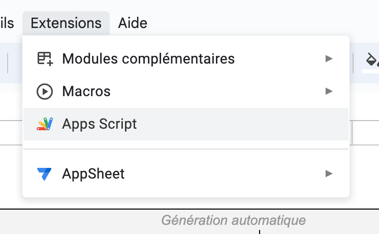
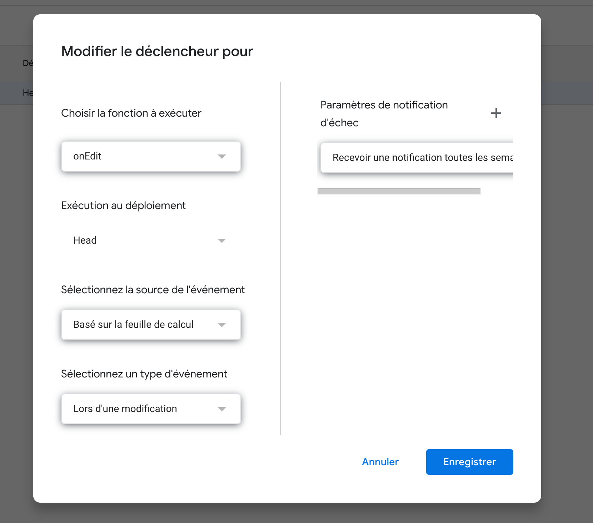

# Google Sheets Geolocation App Script

This Google Sheets App Script is designed to automate the process of fetching geolocation data for addresses in a Google Sheets spreadsheet. It utilizes the OpenStreetMap API to retrieve latitude, longitude, and address information for specified locations, making it easier to work with location-based data in your spreadsheets.

## Getting Started

To use this script, follow these steps:

1. Click on **Extensions** in your Google Sheets.
2. Select **Apps Script** to open the Google Apps Script editor.
3. Replace the contents of the `Code.gs` file in the editor with the provided script.

## Trigger Configuration

To trigger the script to run when a modification is made in the spreadsheet, you need to set up a trigger with the following configuration:

- **Event Source:** Based on the sheet
- **Event Type:** On edit
- **Function to run:** `onEdit`

This configuration will ensure that the `onEdit` function is executed whenever a change is made to the spreadsheet.

## Functionality

The script works as follows:

- Whenever an edit is made to the spreadsheet, it checks if the edited cell is in the reference column (Column A by default).
- If the edited cell is in the reference column, it retrieves geolocation data for the address in that cell.
- The geolocation data includes latitude, longitude, and a formatted address.
- The script then populates adjacent cells with this geolocation information.
- Additionally, it provides a link to Google Maps for the obtained coordinates.

## Example Usage

1. In your Google Sheets, enter addresses in the reference column (Column A).
2. When you make edits or additions in Column A, the script will automatically fetch and populate the corresponding geolocation information in adjacent columns.

## Screenshots

You can refer to the screenshots below for guidance on how to set up the trigger:

## Author

- [gautiermorel](https://github.com/gautiermorel)

## License

This project is licensed under the MIT License - see the [LICENSE](LICENSE) file for details.
